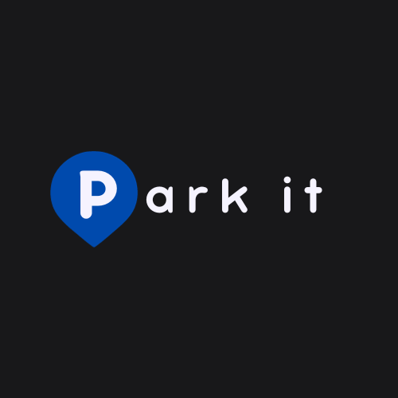

# ParkIt - Parking Space Management Platform

ParkIt is a parking space management platform designed to simplify the reservation and monitoring of parking spaces in private lots.

## About the Project

**Park It** is an innovative parking management system developed to provide an efficient and convenient experience for both parking lot owners and drivers looking for parking spaces. Our goal is to streamline the parking process by providing real-time information on space availability and offering the ability to reserve and pay for spaces directly through the app.

## Key Features

- **Parking Lot Registration:** Parking lot owners can easily register their establishments, specifying the address and operating hours.

- **Parking Space Management:** The system allows real-time tracking of available and occupied parking spaces, providing up-to-date information to customers.

- **Parking Space Reservations:** Customers can reserve parking spaces through the app, providing the vehicle's license plate and selecting an available space.

- **Real-Time Notifications:** Parking lot owners and customers receive real-time notifications regarding reservations, space occupancy, and important updates.

- **Maps and Navigation Integration:** Seamlessly integrate maps and navigation features, providing customers with directions to their reserved parking space.

- **Secure Payment System:** The app allows users to make and receive parking payments directly through the app, providing added convenience and security.

### Usage

- Log in as a parking lot owner or a customer as needed.
- Register parking lots and manage available spaces.
- Reserve parking spaces by providing the vehicle's license plate.
- Monitor real-time space occupancy.
- Use the integrated maps and navigation features to get directions to the reserved parking space.
- Search for parking lots based on location, availability, and price.
- Make secure parking payments directly through the app.

## Contributions

We welcome contributions to improve ParkIt. Feel free to open issues, submit pull requests, and enhance our documentation.